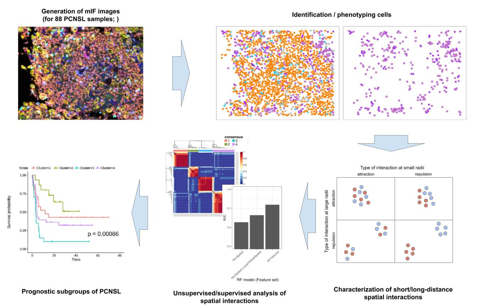

# Multi-scale spatial feature extraction from Vectra data

R script for generating spatial freatures from cellular distribution captured by Vectra data.

## Background

We present a computation framework based on marked Poisson point process theory to quantitatively characterize cellular spatial context at multiple-scale, including short and long-distance spatial interaction between cell type pairs. Unlike other spatial analyses that summarized spatial context at one scale only, for instance, average distance or minimum distance, we took statistics for summarizing spatial interactions at multiple scales, spanning both short-distance (5-25 micro-meters) and long-distance (50-100 micro-meters).

As proof of principle, we generated multiplex imaging data from a rare type of B-cell lymphoma, primary central nervous system lymphoma (PCNSL), for which typically very conflicting reports on the prognosis of TME populations have been reported. By applying the computational framework to a total of 1,393 imaging data from 88 PCNSL samples, we identified 2,980 features that collectively characterize PCNSL TME. A downstream supervised/unsupervised analysis of combined features, including both simple classical features and our multi-scale features, revealed that 1) robust and prognostic subgroups were identifiable only by multi-scale features, and 2) significant improvement of patient survival prediction by these features. In particular, we found an inverse prognostic impact of macrophages that depends on the interaction counterpart, tumor cells for good outcomes and T-cells for poor outcomes, respectively. 

More details for the theory and its application to Vectra data from Primary Central Nervous Cell lymhoma (PCNSL) can be found [here](!https://www.biorxiv.org/content/10.1101/2022.09.27.509403v1).

## Installation

R version 4.0.0 was used. [`install.R`](.install.R) resolves some of the key dependencies.
At the bottom of [`Example.html`](https://htmlpreview.github.io/?https://github.com/anoyaro84/spatstat_vectra/master/Example.html) (or its source code: `Example.Rmd`), there is a full session information that states the required R packages. (see below for the main parts).

> R version 4.0.0 
> attached base packages:
> grid      stats     graphics  grDevices utils     datasets  methods   base     
> 
> other attached packages:
> VIM_6.2.2              colorspace_2.1-0       Rtsne_0.16             survminer_0.4.9        ggpubr_0.2.5           magrittr_2.0.3         readxl_1.4.2           sp_1.5-0              
> latex2exp_0.9.5        reshape2_1.4.4         RColorBrewer_1.1-3     phenoptr_0.3.2         tiff_0.1-11            remotes_2.4.2          spdep_1.2-8            sf_0.9-5              
> spData_2.2.0           spatstat_3.0-3         spatstat.linnet_3.0-6  spatstat.model_3.2-1   rpart_4.1.16           spatstat.explore_3.1-0 nlme_3.1-150           spatstat.random_3.1-4 
> spatstat.geom_3.1-0    spatstat.data_3.0-1    forcats_1.0.0          stringr_1.5.0          dplyr_1.1.1            purrr_1.0.1            readr_2.1.4            tidyr_1.3.0           
> tibble_3.2.1           tidyverse_1.3.2        ggplot2_3.4.1          cowplot_1.1.1          rmarkdown_2.21         nvimcom_0.9-102       

## Usage of script

The main script is `spatstat_vectra.R` that contains two main functions.
- `do_analyse()` : apply marked Poisson point process to given phenotyped tables.
- `feature_extract()` : create an feature matrix from the outcome of `do_analyse()`.

To demonstrate the use and input data, please take a look at [`Example.html`](https://htmlpreview.github.io/?https://github.com/anoyaro84/spatstat_vectra/master/Example.html).
